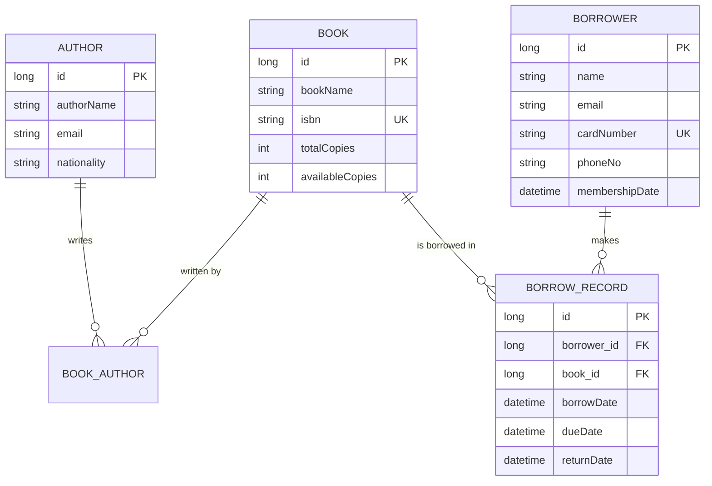

# 📚 Library Management System

A REST API for managing a library's books, authors, borrowers, and borrow/return activity — built with **Java 21**, **Spring Boot 3**, and **raw Hibernate ORM** (no Spring Data JPA, by design — this project is a Hibernate learning ground).

[]()
[]()
[]()
[]()
[]()

> 📖 New to this codebase? Start with [`docs/01-step-by-step-explanation.md`](docs/01-step-by-step-explanation.md) — it explains everything from scratch.

---

## ✨ What it does

- Manage **Books**, **Authors**, and **Borrowers** with full CRUD
- **Borrow** and **return** books, with real business rules enforced (no double-borrowing, no borrowing when copies are unavailable)
- Track **borrow history** per borrower
- Self-documenting API via **Swagger / OpenAPI**

## 🏗️ Tech Stack

| Layer | Technology |
|---|---|
| Language | Java 21 |
| Web Framework | Spring Boot 3.3 (Spring MVC) |
| Persistence | Hibernate ORM 7.x (plain, no Spring Data JPA) |
| Database | PostgreSQL |
| API Docs | springdoc-openapi (Swagger UI) |
| Testing | JUnit 5 + Mockito |
| Build | Maven |

## 📂 Project Structure

```
src/main/java/com/sudhanva/library/
├── Main.java              # Spring Boot entrypoint
├── config/                # Spring bean wiring (SessionFactory, Services)
├── controller/             # REST endpoints (thin — delegate to services)
├── service/                # Business logic + Hibernate transactions
├── dao/                    # Hibernate data-access objects (raw HQL)
├── entity/                 # JPA/Hibernate-annotated domain model
├── dto/                    # Request/response shapes exposed over REST
└── util/HibernateUtil.java # Bootstraps the Hibernate SessionFactory
```

See [`docs/02-high-level-design.md`](docs/02-high-level-design.md) for the full architecture diagram and request flow.

## 🚀 Getting Started

### Prerequisites
- Java 21
- Maven 3.9+
- PostgreSQL running locally with a `library_management` database

### Configure the database
Defaults live in `src/main/resources/hibernate.cfg.xml`. Override them via environment variables instead of editing the file:

```bash
export DB_URL="jdbc:postgresql://localhost:5432/library_management"
export DB_USERNAME="postgres"
export DB_PASSWORD="your_password"
```

### Run it

```bash
mvn spring-boot:run
```

The app starts on **http://localhost:8080**. Hibernate auto-creates/updates tables on boot (`hibernate.hbm2ddl.auto=update`).

### Run the tests

```bash
mvn test
```

### Explore the API

Swagger UI: **http://localhost:8080/swagger-ui/index.html**
OpenAPI spec: **http://localhost:8080/v3/api-docs**

## 🔌 API Overview

| Resource | Endpoints |
|---|---|
| **Books** | `GET /api/books`, `GET /api/books/{isbn}`, `POST /api/books`, `PUT /api/books/{isbn}`, `DELETE /api/books/{isbn}`, `POST /api/books/{isbn}/authors/{authorId}` |
| **Authors** | `GET /api/authors`, `GET /api/authors/{id}`, `POST /api/authors`, `DELETE /api/authors/{id}` |
| **Borrowers** | `GET /api/borrowers`, `GET /api/borrowers/{cardNumber}`, `POST /api/borrowers`, `PUT /api/borrowers/{cardNumber}`, `DELETE /api/borrowers/{cardNumber}` |
| **Borrow Records** | `GET /api/borrow-records`, `GET /api/borrow-records/borrower/{cardNumber}`, `POST /api/borrow-records/borrow?cardNumber=&isbn=`, `POST /api/borrow-records/return?cardNumber=&isbn=` |

### Example: borrow a book

```bash
curl -X POST "http://localhost:8080/api/borrow-records/borrow?cardNumber=CARD001&isbn=ISBN001"
```

```json
{
  "id": 1,
  "borrowerCardNumber": "CARD001",
  "bookIsbn": "ISBN001",
  "borrowDate": "2026-06-30T10:40:01.591",
  "dueDate": null,
  "returnDate": null,
  "active": true
}
```

## 📐 Data Model



## 📚 Documentation

| Doc | What's in it |
|---|---|
| [`docs/01-step-by-step-explanation.md`](docs/01-step-by-step-explanation.md) | A from-scratch, plain-English walkthrough of how the whole app works |
| [`docs/02-high-level-design.md`](docs/02-high-level-design.md) | Architecture diagram, layer responsibilities, request lifecycle |

## 🧪 Testing Strategy

Service-layer business logic is unit tested with **JUnit 5 + Mockito** — the Hibernate `SessionFactory`/`Session`/`Transaction` and DAOs are mocked so tests run instantly with no real database. Coverage includes happy paths, not-found cases, and business-rule violations (e.g. borrowing an already-borrowed book, borrowing with zero copies available).

```bash
mvn test
```

## 🛠️ Notable Design Choices

- **No Spring Data JPA** — DAOs use raw Hibernate `Session`/`Query` deliberately, for learning purposes.
- **DTOs everywhere on the API boundary** — entities are never serialized directly, avoiding `LazyInitializationException` and circular-reference JSON issues from the `Book ⇄ Author` many-to-many and `Borrower/Book ⇄ BorrowRecord` relationships.
- **Thread-bound Hibernate sessions** (`hibernate.current_session_context_class=thread`) — each HTTP request thread gets its own `Session`, scoped to the transaction in the service method.
