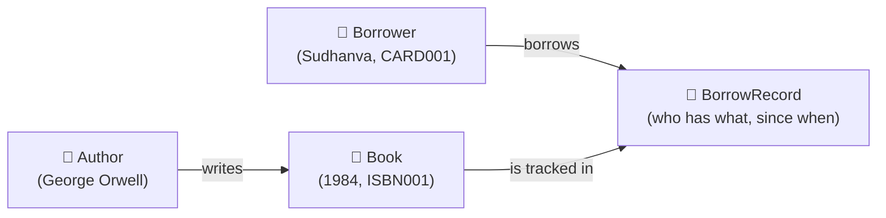
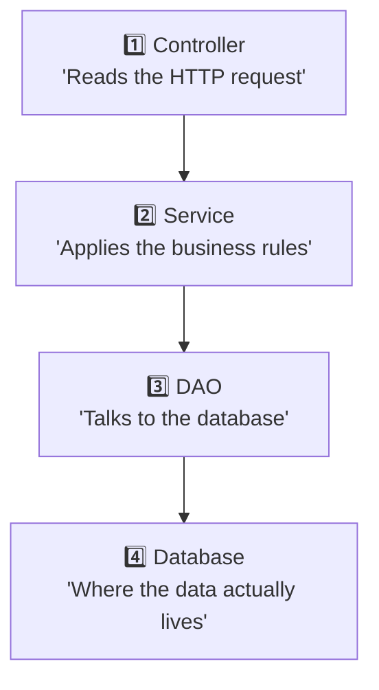

# How This App Works — Explained From Scratch

This doc assumes you know nothing about this codebase. By the end, you should understand exactly what happens when someone "borrows a book" through this API.

---

## 1. What is this app, in one sentence?

It's a **librarian's notebook turned into a web service** — instead of writing in a paper ledger who borrowed which book, people send HTTP requests, and the app reads/writes that information in a database.

## 2. The four things this app keeps track of

Think of four boxes:



- **Author** — a person who wrote a book. One author can write many books, and one book can have many authors (e.g. a co-authored book).
- **Book** — has a name, an ISBN (a unique code, like a book's fingerprint), and a count of how many copies exist vs. how many are currently available.
- **Borrower** — a library member, identified by a unique card number.
- **BorrowRecord** — the actual "receipt" of a borrow event: which borrower took which book, when, and whether it's been returned.

## 3. The four layers, like an onion 🧅

Every request that comes in passes through four layers, in order:



### 1️⃣ Controller — "the receptionist"
Lives in `controller/`. Its only job is: read what came in over HTTP (a URL, some JSON), and hand it to the right Service. It doesn't know *how* borrowing works — it just routes the request.

```java
@PostMapping("/borrow")
public BorrowRecordDTO borrowBook(@RequestParam String cardNumber, @RequestParam String isbn) {
    return borrowService.borrowBook(cardNumber, isbn);
}
```

### 2️⃣ Service — "the librarian who knows the rules"
Lives in `service/`. This is where the actual thinking happens:
- "Does this book exist?"
- "Is a copy available?"
- "Does this borrower already have this book?"

If any rule is broken, it throws an error (e.g. `"No Coppies Available"`), and that error bubbles back up to become an HTTP `400 Bad Request`.

### 3️⃣ DAO — "the filing clerk"
Lives in `dao/`. DAO = **D**ata **A**ccess **O**bject. Its only job is running database queries — "find me the book with this ISBN," "save this new borrow record." It doesn't make decisions, it just fetches/stores.

### 4️⃣ Database — "the actual filing cabinet"
PostgreSQL. Tables: `books`, `authors`, `borrowers`, `borrow_records`, `book_author` (a join table for the many-to-many between books and authors).

## 4. Walkthrough: "Borrow a book" from start to finish

Let's trace one real request:

```
POST /api/borrow-records/borrow?cardNumber=CARD001&isbn=ISBN001
```

**Step 1 — Controller receives it.**
`BorrowController.borrowBook()` pulls `cardNumber` and `isbn` out of the URL and calls `borrowService.borrowBook("CARD001", "ISBN001")`.

**Step 2 — Service opens a "transaction."**
A transaction is like saying *"everything I'm about to do should either ALL succeed, or ALL be undone — no half-finished changes."* This matters because borrowing involves two changes at once (decrease the book's available copies, AND create a borrow record) — we never want only one of those to happen.

**Step 3 — Service checks the rules, one by one:**
1. Does a borrower with card `CARD001` exist? (look it up via `BorrowerDAO`)
2. Does a book with ISBN `ISBN001` exist? (look it up via `BookDAO`)
3. Are there available copies (`availableCopies > 0`)?
4. Does this borrower already have an unreturned copy of this exact book?

If any check fails, the service throws an error immediately and nothing is saved (the transaction rolls back).

**Step 4 — If all checks pass:**
- `book.availableCopies` goes down by 1
- A new `BorrowRecord` is created with today's date as the borrow date
- Everything is saved to the database, and the transaction commits (made permanent)

**Step 5 — Service converts the result into a DTO.**
Why not just send the database object back? Because the database object (`BorrowRecord` entity) has links back to the `Borrower` and the `Book`, which themselves link to more things — sending it directly as JSON could loop forever or crash. So the service builds a small, flat `BorrowRecordDTO` with just the fields a client actually needs:

```json
{
  "id": 1,
  "borrowerCardNumber": "CARD001",
  "bookIsbn": "ISBN001",
  "borrowDate": "2026-06-30T10:40:01.591",
  "dueDate": null,
  "returnDate": null,
  "active": true
}
```

**Step 6 — Controller sends this DTO back as the HTTP response.**

## 5. What happens when something goes wrong?

Say you try to borrow a book with ISBN `DOES-NOT-EXIST`. The service throws:

```java
throw new RuntimeException("Book not found");
```

This exception travels all the way back up to a special class called `GlobalExceptionHandler`, which catches **any** `RuntimeException` thrown by any service, and turns it into a clean HTTP response instead of a scary stack trace:

```
HTTP 400 Bad Request
{"error": "Book not found"}
```

## 6. Why is there no `password123` style hardcoded secret?

The database password isn't hardcoded — `HibernateUtil.java` checks for environment variables (`DB_URL`, `DB_USERNAME`, `DB_PASSWORD`) first, and only falls back to the default config file if they're not set. This means you can run the same code against different databases (your laptop, a teammate's laptop, a server) just by changing environment variables — no code changes needed.

## 7. Why does the app "remember" things across requests, but each request is independent?

Each HTTP request runs on its own thread, and Hibernate gives each thread exactly one `Session` (think of a `Session` as "a single conversation with the database"). When the transaction inside a request commits or rolls back, that conversation ends. The next request — even from the same user — starts a brand new conversation. There's no shared memory between requests; everything that needs to persist is written to the actual PostgreSQL database.

## 8. How do I see this for myself?

1. Start the app: `mvn spring-boot:run`
2. Open Swagger UI in a browser: `http://localhost:8080/swagger-ui/index.html`
3. Try `POST /api/books` to create a book, `POST /api/borrowers` to create a borrower, then `POST /api/borrow-records/borrow` to borrow it.
4. Watch the terminal — `hibernate.show_sql=true` means every SQL statement Hibernate runs gets printed, so you can see exactly what's happening at the database level in real time.

## 9. Glossary

| Term | Plain-English meaning |
|---|---|
| **ORM** (Object-Relational Mapping) | A tool that lets you work with database rows as if they were normal Java objects, instead of writing raw SQL everywhere |
| **Hibernate** | The specific ORM tool this project uses |
| **Entity** | A Java class that represents a database table (e.g. `Book.java` ↔ `books` table) |
| **DTO** (Data Transfer Object) | A simple Java class shaped just for sending/receiving over the API — not tied to the database structure |
| **DAO** (Data Access Object) | A class whose only job is running database queries for one entity |
| **HQL** | Hibernate Query Language — like SQL, but written in terms of Java entity names instead of table/column names |
| **Transaction** | A group of database changes that succeed or fail together, as one unit |
| **Session** (Hibernate) | One "conversation" with the database, scoped to a thread/transaction |
| **DTO mapping** | Converting an Entity (database shape) into a DTO (API shape) before sending it out |
