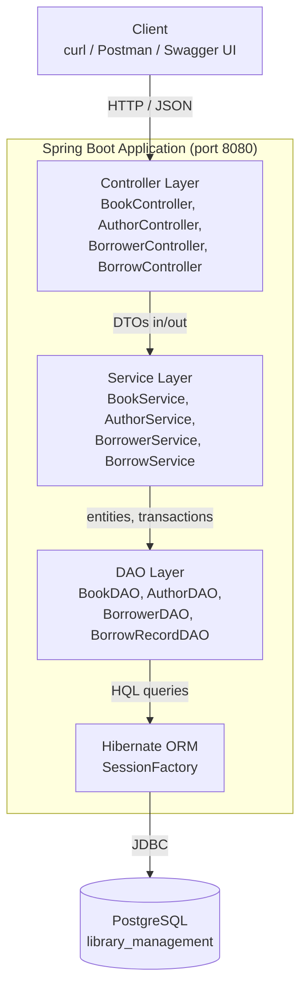
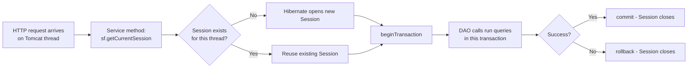

# High-Level Design (HLD)

## 1. System Overview

The Library Management System is a single Spring Boot service backed by PostgreSQL. There is no separate frontend, message queue, or microservice split — it's a classic layered monolith, which is appropriate for its scope.



## 2. Layer Responsibilities

| Layer | Package | Responsibility | Knows about Hibernate? |
|---|---|---|---|
| **Controller** | `controller/` | Parse HTTP requests, call a service, return DTOs. No business logic. | No |
| **Service** | `service/` | Business rules, transaction boundaries (`beginTransaction`/`commit`/`rollback`), maps entities → DTOs | Yes |
| **DAO** | `dao/` | Raw Hibernate `Session`/`Query` (HQL) for one entity type | Yes (directly) |
| **Entity** | `entity/` | JPA-annotated domain objects mapped to tables | N/A (is the mapping) |
| **DTO** | `dto/` | Plain objects shaped for the JSON wire — decouples API contract from DB schema | No |

**Why DTOs everywhere?** Entities have circular/lazy relationships (`Book ⇄ Author`, `Borrower/Book ⇄ BorrowRecord`). Serializing an entity straight to JSON either infinite-loops or throws `LazyInitializationException` once the Hibernate session closes. DTOs are built **inside** the transaction, before the session closes, so all needed data is already loaded.

## 3. Request Lifecycle — Example: "Borrow a Book"

```mermaid
sequenceDiagram
    participant C as Client
    participant BC as BorrowController
    participant BS as BorrowService
    participant BD as BorrowerDAO
    participant BkD as BookDAO
    participant H as Hibernate Session
    participant DB as PostgreSQL

    C->>BC: POST /api/borrow-records/borrow?cardNumber=..&isbn=..
    BC->>BS: borrowBook(cardNumber, isbn)
    BS->>H: getCurrentSession() + beginTransaction()
    BS->>BD: findByCardNumber(cardNumber)
    BD->>DB: SELECT * FROM borrowers WHERE card_number = ?
    DB-->>BD: Borrower row
    BS->>BkD: findByIsbn(isbn)
    BkD->>DB: SELECT * FROM books WHERE isbn = ?
    DB-->>BkD: Book row

    alt no copies available
        BS-->>BC: throw RuntimeException("No Coppies Available")
        BC-->>C: 400 Bad Request
    else already borrowed
        BS-->>BC: throw RuntimeException("Borrower already has this book")
        BC-->>C: 400 Bad Request
    else happy path
        BS->>BS: book.availableCopies--
        BS->>H: session.persist(new BorrowRecord)
        BS->>H: transaction.commit()
        H->>DB: INSERT INTO borrow_records ...; UPDATE books SET available_copies = ...
        BS-->>BC: BorrowRecordDTO
        BC-->>C: 200 OK + JSON
    end
```

## 4. Session & Transaction Model

Hibernate is configured with `hibernate.current_session_context_class=thread`: each thread gets exactly one `Session`, lazily opened on first use and bound to that thread.

- Spring/Tomcat handles each HTTP request on its own thread (thread-per-request).
- Each service method explicitly opens a transaction (`session.beginTransaction()`), does its work, and commits or rolls back.
- This is **not** Spring-managed `@Transactional` — it's manual, classic Hibernate, by design (this project is a Hibernate-learning exercise, not a Spring Data JPA showcase).



## 5. Data Model

See the ER diagram in the [README](../Readme.md#-data-model). Key relationships:

- `Book ⇄ Author` — many-to-many (`book_author` join table)
- `Borrower → BorrowRecord` — one-to-many
- `Book → BorrowRecord` — one-to-many
- `BorrowRecord` is the **bridge entity** that captures the history of who borrowed what and when

## 6. Error Handling

`GlobalExceptionHandler` (`@RestControllerAdvice`) catches any `RuntimeException` thrown by a service (e.g. "Book not found", "No Coppies Available") and converts it into a `400 Bad Request` with a JSON body `{"error": "..."}` — instead of leaking a stack trace as a `500`.

## 7. What's deliberately NOT here

- **No Spring Data JPA / Repositories** — DAOs are hand-written HQL, intentionally, for learning Hibernate internals.
- **No authentication/authorization** — out of scope for this exercise.
- **No caching layer** — `hibernate.show_sql` is on for visibility into generated SQL; not tuned for production.
